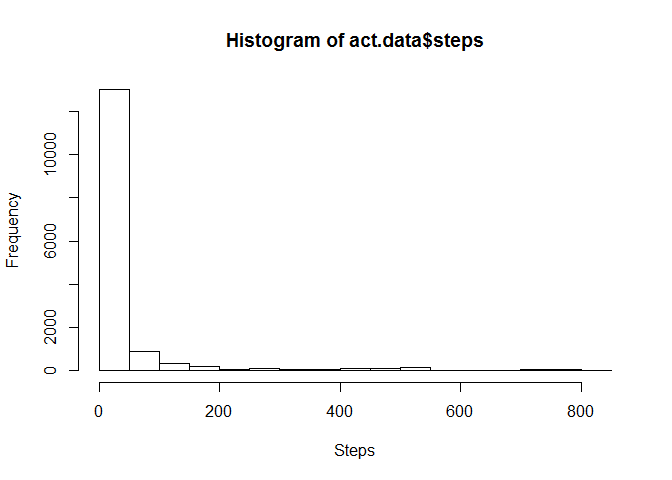
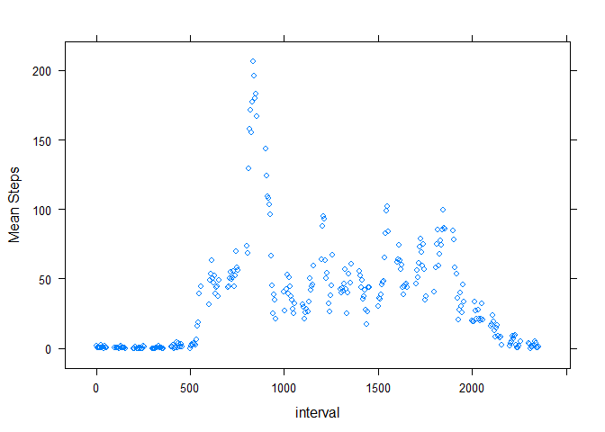
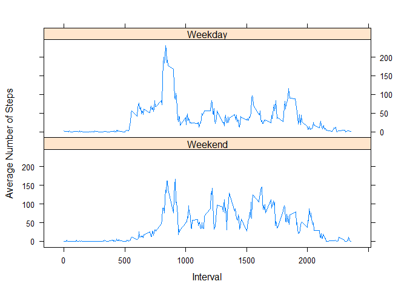

# Reproducible Research: Peer Assessment 1


## Loading and preprocessing the data
The following code assumes the file activity.zip is in the current directory and unzips the data to the data subfolder.

```r
  ##load libraries
  library(dplyr)
```

```
## 
## Attaching package: 'dplyr'
```

```
## The following objects are masked from 'package:stats':
## 
##     filter, lag
```

```
## The following objects are masked from 'package:base':
## 
##     intersect, setdiff, setequal, union
```

```r
  library(chron)
```

```
## Warning: package 'chron' was built under R version 3.2.3
```

```r
  library(lattice)
  unzip ("activity.zip", exdir="./data");
  act.data <- read.csv("data/activity.csv",header=TRUE,na="NA")
```

## What is mean total number of steps taken per day?

```r
  hist(act.data$steps, xlab="Steps")
```



```r
  ## Get the sum per date and take mean and median
  steps.data <- group_by(act.data, date)   %>% 
    summarise(steps = sum(steps, na.rm="TRUE"))  %>% 
      summarise(mean.steps=mean(steps,na.rm="TRUE"), median.steps=median(steps,na.rm="TRUE"))
```

The mean number of steps per day is 9354.2295082

The median number of steps per day is 10395

## What is the average daily activity pattern?

```r
  ##Get the mean number of steps per interval
  steps.by.interval <- group_by(act.data, interval)     %>% 
    summarise(mean.steps=mean(steps, na.rm="TRUE"))
  ##Plot average steps per interval
  xyplot(mean.steps~interval,data = steps.by.interval, ylab="Mean Steps")
```



```r
  ##Determine the interval with max number of steps after removing NA's
  max.interval <- steps.by.interval$interval[which.max(steps.by.interval$steps)]
```

The interval  has the maximum average number of steps.


## Imputing missing values
There are 2304 NA values out of 17568 records.  To impute the missing values we will take the mean value for the interval across all the other days.

```r
  ##Join with steps.by.interval df created in previous section to get the average for interval
  act.data.new <-inner_join(act.data, steps.by.interval, by=c("interval"="interval"))
  act.data.new$steps[is.na(act.data.new$steps)] <- act.data.new$mean.steps[is.na(act.data.new$steps)]
```
## Are there differences in activity patterns between weekdays and weekends?

```r
  ##Convert date to an actual data datatype and determine if it is a weekend
  act.data.new$date <-strptime(act.data.new$date, format="%Y-%m-%d")
  act.data.new$weekend <- chron::is.weekend(act.data.new$date)
  
  ##Remove columns no longer needed
  act.data.new <- select(act.data.new, steps, interval, weekend)
  
  ##Convert weekend to a factor 
  act.data.new$weekend <- factor(act.data.new$weekend, 
      levels=c("TRUE","FALSE"), labels=c("Weekend", "Weekday"))
      
  ##Summarize for graph
  act.data.new <- group_by(act.data.new, weekend, interval) %>%
    summarise(steps = mean(steps)) %>%
      arrange(interval)
  xyplot( steps~interval | weekend, data=act.data.new, type = "l", layout=c(1,2), 
    xlab="Interval", ylab="Average Number of Steps")
```


